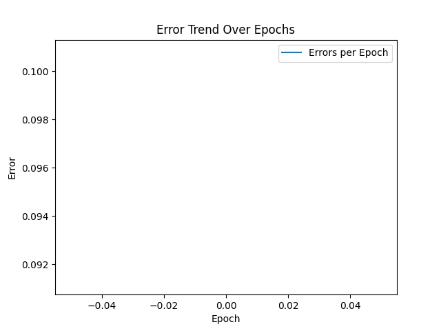

# 🚢 RNA - Titanic




> O projeto RNA-Titanic visa treinar uma rede neural artifical com dados sobre as pessoas que estavam embarcadas no Titanic a fim de determinar, baseado nesses dados, se uma pessoa sobreviveria ou não ao naufrágeo do navio.

## 💻 Pré-requisitos

Antes de começar, verifique se você atendeu aos seguintes requisitos:

- Google Colab ou Jupyter Notebook

## 🚀 Instalando

Para instalar, siga estas etapas:

Crie um clone do repositório

```
git clone https://github.com/Seiixas/rna-titanic.git
```

Faça o upload dos arquivos `titanic.csv` e `titanic.ipynb` no Google Colab ou Jupyter Notebook.

Leia as instruções markdown e execute as células Python presentes no notebook.
